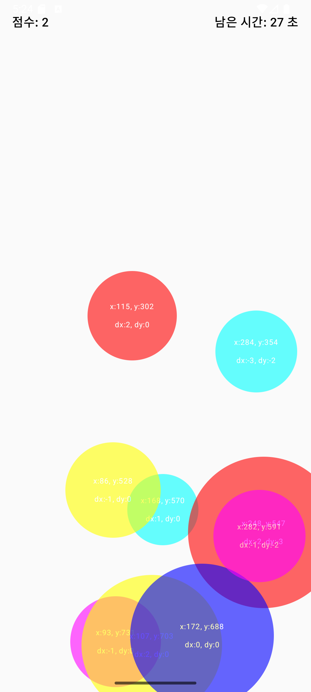
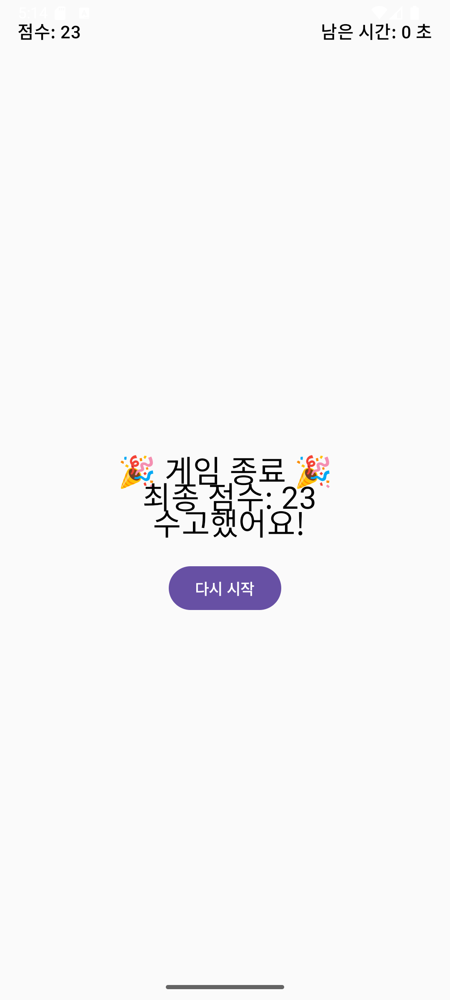

<h2>📸 앱 실행 화면</h2>

<table>
  <tr>
    <td>
       
      
포즈 인식 화면

    </td>
    <td>
       
      
클릭 버튼 추가

    </td>
    <td>
       
      
StopWatchApp

    </td>
    <td>
       
      
Click ME!

    </td>
    <td>
       
      
게임 시작 화면

       
      
버블 게임 25.10.22

    </td>
  </tr>
</table>
